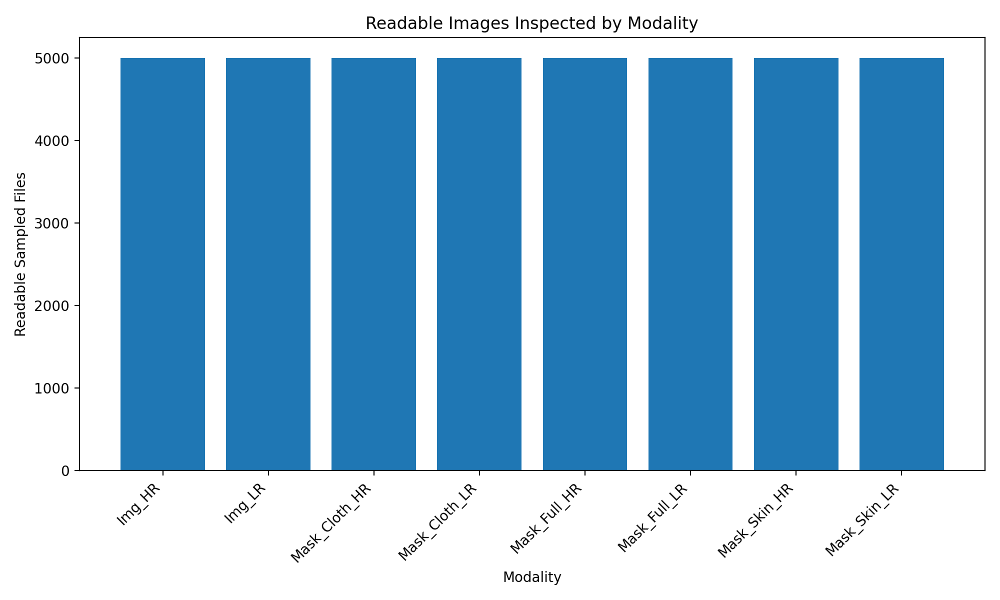
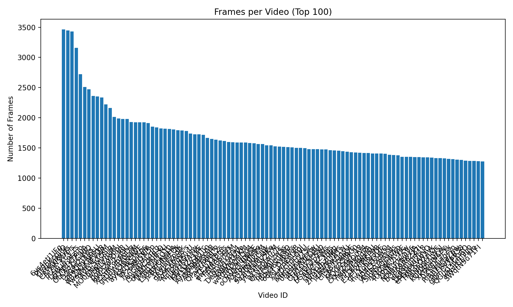
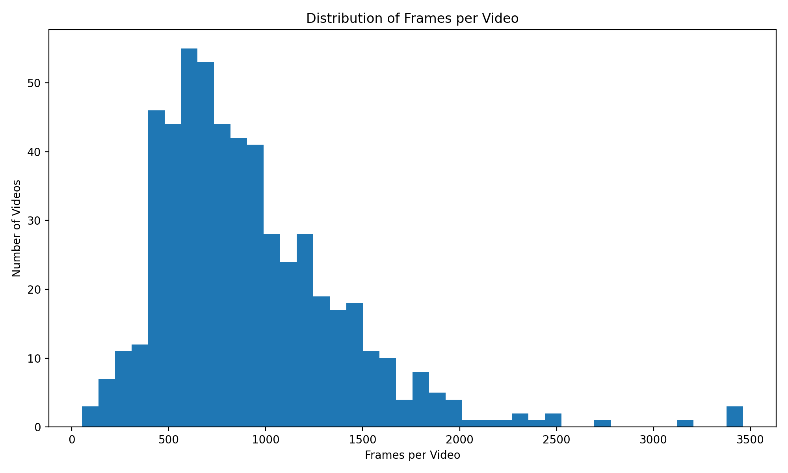
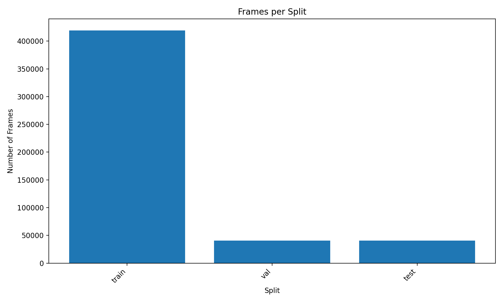
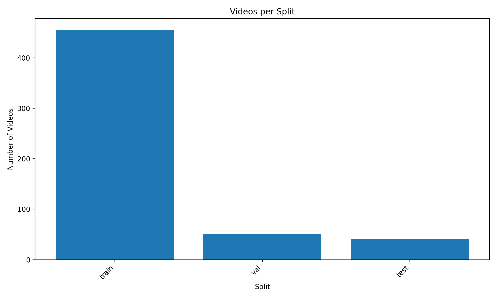
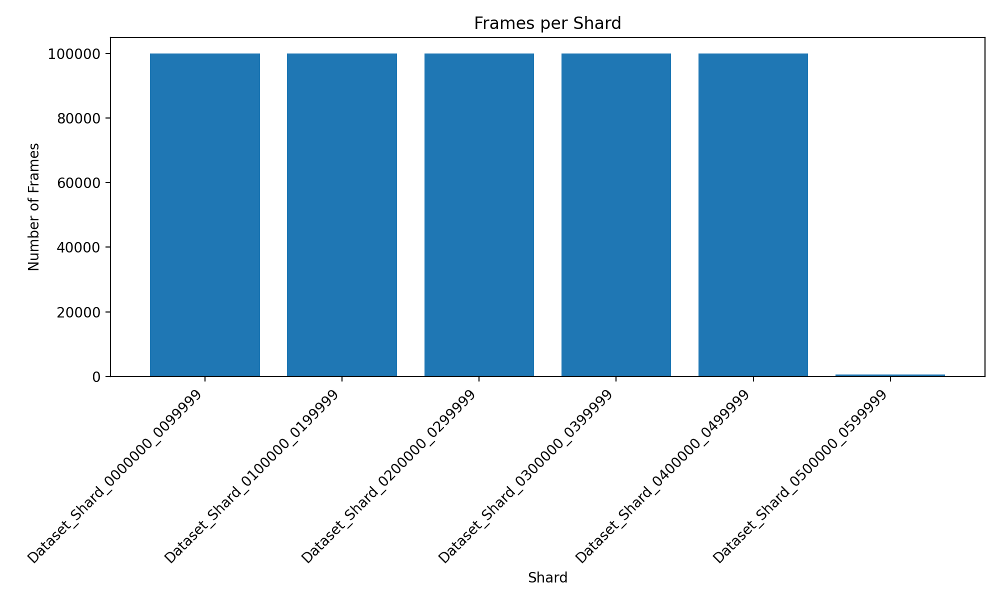
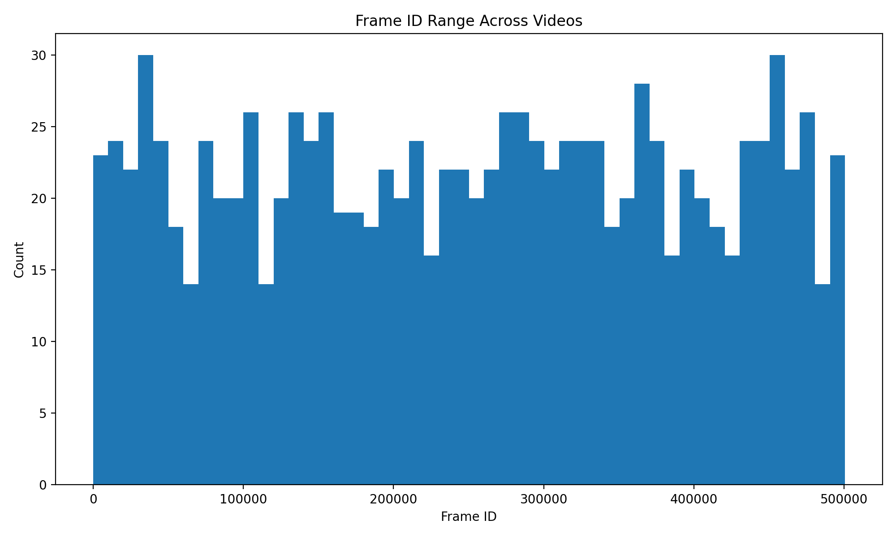
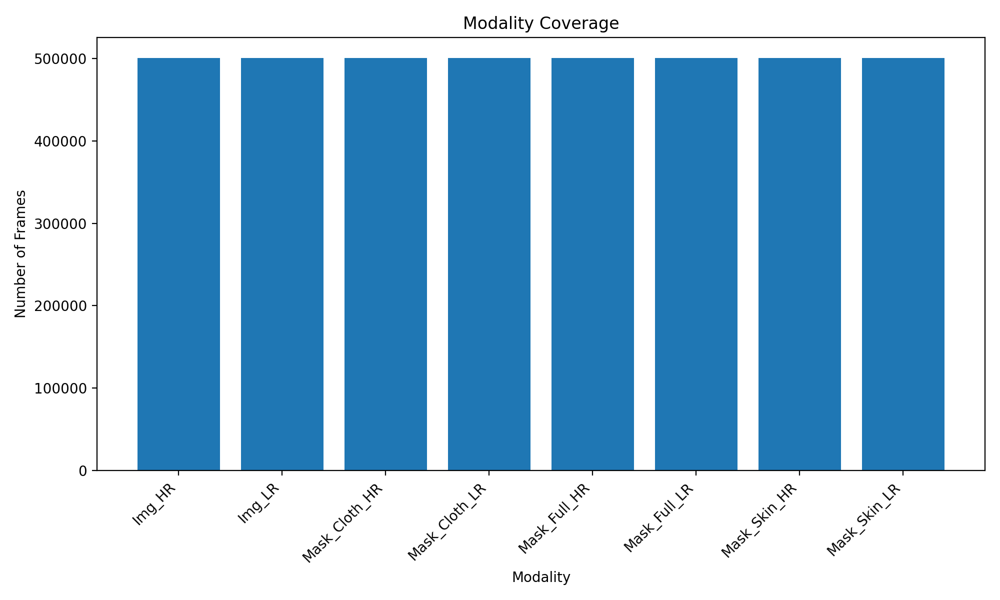

# Dataset Statistics — Figures

This directory contains the visualizations generated from the statistical analysis of the PhySense-Human dataset.

The figures provide a visual overview of the dataset's scale, split composition, temporal structure, shard distribution, modality availability, and image resolution.

These plots are **dataset-analysis artifacts**, not final experimental results.

---

## Figures

### 1. Dataset Resolution

#### `resolution_distribution.png`

Shows the distribution of image resolutions present in the dataset.

This figure is important for understanding the visual characteristics of the dataset and determining whether the images follow a consistent resolution format.

It is particularly relevant for the later super-resolution and reconstruction experiments because the choice of input/output resolution and degradation model depends on the underlying resolution distribution.



---

### 2. Frames per Video

#### `frames_per_video.png`

Shows the number of extracted frames associated with each source video.

The dataset was constructed by sampling frames from YouTube videos at approximately one-second intervals. Therefore, the number of frames associated with a video provides an approximate representation of how much temporal information that video contributes to the dataset.



This distribution is important for evaluating whether the dataset contains sufficient temporal information for multi-frame reconstruction.

---

### 3. Frames per Video Distribution

#### `frames_per_video_distribution.png`

Provides the statistical distribution of the number of frames contributed by individual videos.

While `frames_per_video.png` shows the individual video-level values, this figure provides a more compact view of the overall distribution.

It helps identify:

- short source videos,
- long source videos,
- the typical number of frames per video,
- highly represented videos,
- and potential imbalance in video contributions.



This is particularly relevant because the dataset should ideally not be dominated by a very small number of source videos.

---

### 4. Frames per Split

#### `frames_per_split.png`

Shows the number of frames assigned to each dataset split:

- train
- validation
- test



The split distribution provides an initial view of how the available data is allocated for training and evaluation.

However, because individual frames from the same video are strongly correlated, frame counts alone are not sufficient to evaluate split quality.

The corresponding video-level analysis is therefore also important.

---

### 5. Videos per Split

#### `videos_per_split.png`

Shows the number of unique source videos assigned to the training, validation, and test splits.



This figure is especially important for this dataset because the fundamental unit of independence is the **source video**, rather than an individual frame.

The integrity audit verified that no source video was detected in more than one of the train, validation, or test splits.

Therefore, the evaluation set is separated from the training data at the video level.

---

### 6. Frames per Shard

#### `frames_per_shard.png`

Shows the number of frames contained in each dataset shard.



The dataset is physically divided into multiple shards to make storage and processing of the approximately 500K-frame dataset more manageable.

The shard boundaries are a storage/organization mechanism and should not be interpreted as independent datasets.

A source video may span multiple shards, which is why shard-level statistics must be distinguished from video-level statistics.

---

### 7. Frame ID Distribution

#### `frame_id_distribution.png`

Shows the distribution of frame identifiers in the dataset.



Frame IDs are useful for understanding the temporal organization of the extracted frames.

The filename convention contains both a frame identifier and the source video identifier.

For example:

`frame_0000033_-Hs-zuBOlQE.jpg`

where:

- `0000033` is the frame identifier
- `-Hs-zuBOlQE` is the source YouTube video identifier

This structure allows the dataset to be analyzed both at the frame level and at the source-video level.

---

### 8. Modality Counts

#### `modality_counts.png`

Shows the availability and distribution of the different modalities associated with each frame.

The dataset contains:

- HR images
- LR images
- Cloth masks
- Full-body masks
- Skin masks



The modality information is important because the dataset is not limited to RGB image pairs.

The human-related masks can potentially support future experiments involving:

- human-region-aware reconstruction,
- clothing-aware reconstruction,
- skin-region analysis,
- human-centric super-resolution,
- and region-specific evaluation.

The integrity audit confirmed complete frame-level correspondence across the expected modalities.

---

# What These Figures Tell Us

Taken together, these figures provide an initial statistical description of the dataset.

They allow us to inspect:

### Dataset scale

Approximately **500,507 HR frames** are currently indexed across **547 source videos**.

### Dataset composition

The dataset is divided into training, validation, and test splits at the source-video level.

### Temporal structure

Because frames originate from videos and were sampled at approximately one-second intervals, the dataset contains temporal relationships that can later be investigated for multi-frame reconstruction.

### Data organization

The dataset is distributed across multiple physical shards, while the source-video identity remains the more meaningful unit for research analysis.

### Image characteristics

The resolution distribution provides information needed to design appropriate super-resolution and reconstruction experiments.

### Human-centric information

The availability of cloth, full-body, and skin masks provides additional information beyond conventional LR/HR image pairs.

---

# Why These Figures Matter for the Research

The objective at this stage is **not yet to claim that the dataset solves a particular reconstruction problem**.

Instead, these statistics establish whether the dataset has the properties required to investigate such a problem.

The analysis is therefore moving through the following progression:

```text
Dataset Integrity
       ↓
Dataset Statistics
       ↓
Temporal Redundancy
       ↓
Motion Analysis
       ↓
Visual Correspondence
       ↓
Reconstruction Experiments
       ↓
Research Question
