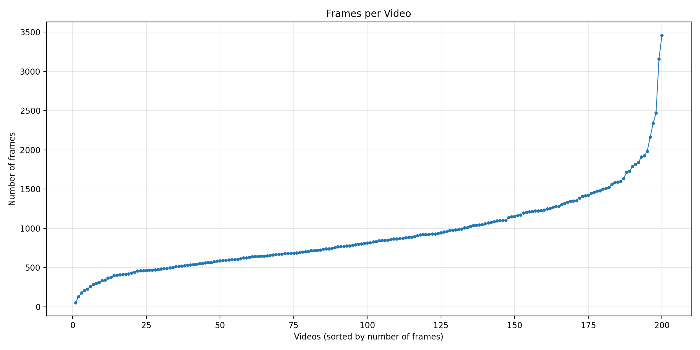
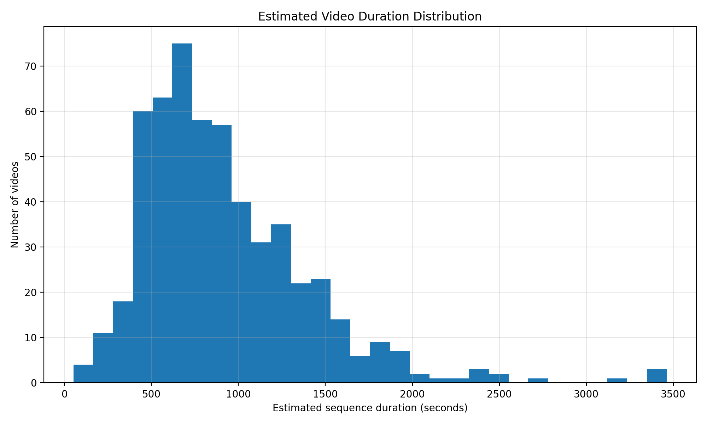
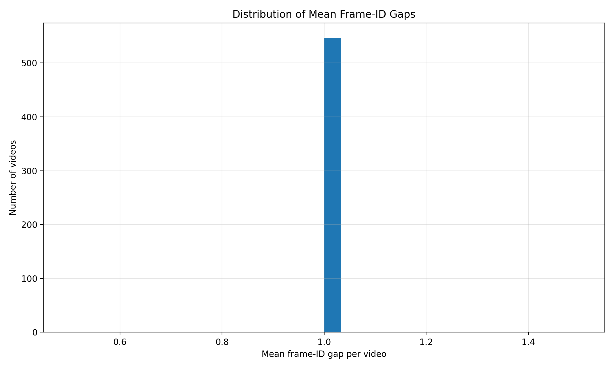
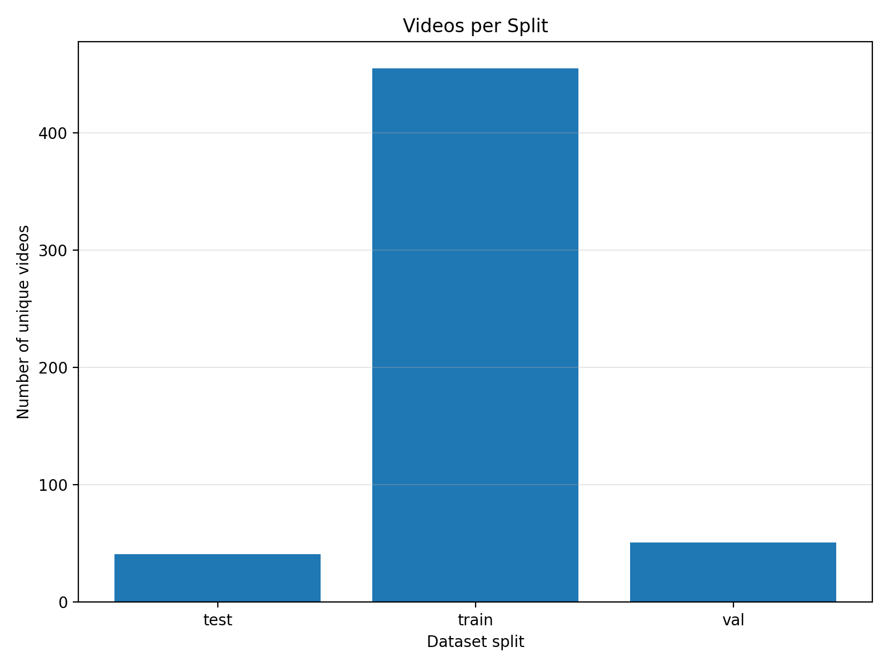
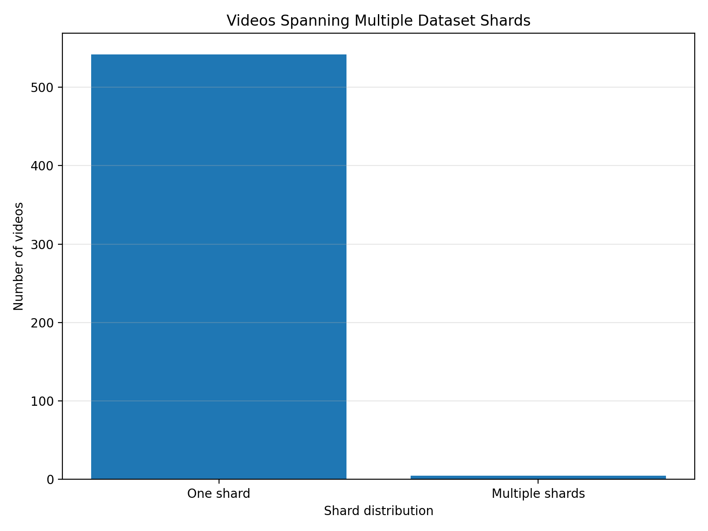

# Temporal Structure — Visual Analysis

This directory contains the visual results of the temporal structure
analysis performed by `01_temporal_structure.py`.

The purpose of these figures is to understand how the 500,507 frames are
organized across 547 videos and whether the dataset provides continuous
temporal sequences suitable for further temporal analysis.

---

## Dataset Overview

The temporal analysis identified:

| Property | Result |
|---|---:|
| Total HR frames | 500,507 |
| Unique videos | 547 |
| Dataset shards | 6 |
| Temporal transitions | 499,960 |
| Adjacent transitions | 499,960 |
| Non-adjacent transitions | 0 |
| Global continuity ratio | 1.000000 |
| Videos with frame-ID gaps | 0 |
| Videos spanning shards | 5 |

These results indicate that the dataset is temporally well-structured.

The following figures visualize the main properties of this structure.

---

# 1. Frames per Video



### What does this figure show?

This figure shows the number of sampled frames available for each video.

The dataset contains videos with substantially different sequence lengths:

- Minimum: **52 frames**
- Median: **815 frames**
- Mean: **915 frames**
- Maximum: **3,462 frames**

Therefore, the dataset does not consist of isolated images. Instead, each
video contributes a temporally ordered sequence of observations.

### Why is this important?

Longer sequences provide multiple observations of the same human subject
over time.

These observations may contain changes in:

- human pose
- body configuration
- clothing deformation
- viewpoint
- illumination
- camera position
- interaction between the subject and clothing

This temporal information may become useful for reconstruction and
super-resolution.

---

# 2. Estimated Video Duration



### What does this figure show?

This figure provides an estimate of the temporal duration represented by
each video based on the sampling structure.

Because frames were sampled at approximately one-second intervals, the
number of sampled frames gives an approximate indication of how much
temporal coverage each video provides.

### Why is this important?

The dataset contains sequences that cover substantially different amounts
of time.

This means that some videos provide only a relatively short temporal
context, while others provide much longer sequences.

This variation is useful when studying whether additional temporal
observations provide useful information for reconstruction.

---

# 3. Temporal Frame Gap Distribution



### What does this figure show?

This figure examines the temporal gaps between consecutive frame IDs.

The analysis found:

- **499,960** temporal transitions
- **499,960** adjacent transitions
- **0** non-adjacent transitions
- **0** videos with frame-ID gaps

The resulting global continuity ratio is:

**1.000000**

### What does this tell us?

The extracted frame sequences are structurally continuous.

In other words, the temporal ordering encoded in the frame IDs does not
contain detected gaps.

This is important because temporal analysis requires reliable ordering of
observations.

### Important distinction

Temporal continuity does **not** mean that neighboring images are visually
identical.

For example:

```text
Frame t
   ↓
Frame t+1
   ↓
Frame t+2
```

may be temporally adjacent while still containing meaningful visual
changes caused by human motion, clothing deformation, or camera movement.

Therefore, this analysis establishes temporal structure, but not temporal
visual redundancy.

That question is addressed in the next stage.

---

# 4. Videos per Split



### What does this figure show?

This figure shows how the videos are distributed across the dataset splits.

The important property is that the split is evaluated at the video level.

The integrity analysis found:

- Train/Validation video overlap: **0**
- Train/Test video overlap: **0**
- Validation/Test video overlap: **0**

### Why is this important?

For a video dataset, randomly splitting individual frames can cause
information leakage.

For example:

```text
Video A
 ├── Frame 001 → train
 ├── Frame 002 → train
 ├── Frame 003 → test
 └── Frame 004 → test
```

would place highly related temporal observations of the same video in
different splits.

The current dataset does not show this type of video-level overlap.

This provides a cleaner basis for later experiments involving temporal
information.

---

# 5. Videos Spanning Multiple Shards



### What does this figure show?

This figure shows videos whose frames are distributed across more than one
dataset shard.

The analysis identified:

**5 videos spanning multiple shards.**

### Is this a dataset problem?

No.

The shards are storage partitions and a video can cross a shard boundary
when its frame IDs cross the corresponding storage range.

For example:

```text
Video A
    │
    ├── frames 99990–99999
    │       ↓
    │   Shard 0000000_0099999
    │
    └── frames 100000–100050
            ↓
        Shard 0100000_0199999
```

This does not indicate duplicate temporal identities or split leakage.

The important integrity checks remain:

- Duplicate `(video_id, frame_id)` records: **0**
- Frame-ID gaps: **0**
- Video-level split leakage: **0**

---

# Overall Interpretation

These figures establish an important property of the PhySense-Human
dataset:

> The dataset contains long, temporally ordered video sequences rather
> than a collection of independent images.

The temporal structure can be summarized as:

**500,507 frames → 547 videos → 499,960 temporal transitions → 100%
adjacent continuity → 0 frame-ID gaps**

This is a strong structural foundation for studying temporal information.

However, one important question remains unanswered:

> Do temporally adjacent frames contain mostly redundant visual
> information, or do they provide complementary information that could be
> exploited for reconstruction and super-resolution?

The current analysis cannot answer this question because it only examines
the temporal organization of the frame IDs.

---

# From Temporal Structure to Visual Redundancy

The next analysis therefore moves from metadata-level temporal structure to
actual image content.

```text
01_temporal_structure.py
          │
          │
          ▼
Temporal continuity established
          │
          ▼
02_frame_similarity.py
          │
          │
          ▼
Measure visual similarity between neighboring frames
          │
          ▼
03_temporal_difference.py
          │
          ▼
Measure visual changes over time
          │
          ▼
04_motion_analysis.py
          │
          ▼
Understand human and camera motion
          │
          ▼
05_temporal_correspondence.py
          │
          ▼
Determine whether information can be transferred
between neighboring frames
```

The goal is not to assume that temporal redundancy exists.

Instead, the next analyses will determine empirically:

1. how similar neighboring frames actually are,
2. how much visual information changes over time,
3. whether motion creates complementary observations,
4. and whether neighboring frames contain information that could help
   reconstruct a higher-quality image.

These observations will later be used to formulate the research hypothesis
and research question.
